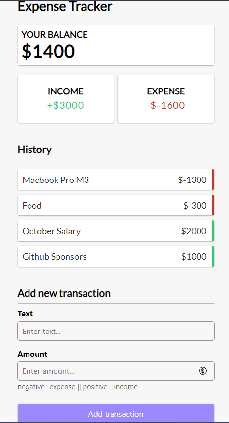

## Application Name
Expense Tracker

## Application Url
If you want to see the demo of this app, check it there [Expense Trancker](https://expense-tracker-c4km.onrender.com/) 😁

## Description
Expense Tracker is an app that lets you track your daily expenses and manage your budget. You can add custom expense categories and track your spending by category. The app is easy to use and designed to help you stay on track with your budget.

## Technologies used
For this projet we used several technology : 
 - HTML : For markup language
 - CSS : For styling
 - Javascript:  For Interactivity part
  
  ### Framework
- [Vuejs](https://vuejs.org) : Javascript framework
- [VueToastification](https://vue-toastification.maronato.dev/) : For beautiful alerte after actions
- [Formkit](https://formkit.com/) : Form management
- [AutoAnimate](https://auto-animate.formkit.com/) : Bringing some animation 
## Features
With this application, you can, create expenses, delete expenses, cehck your balance, check also your income and you expense.

## Screenshots

### Follow me
You can learn more, by contact me on [X](https://twitter.com/MbounaU)(Aka Twitter) or on [LinkedIn](https://www.linkedin.com/in/ulrich-mbouna/). Thanks
